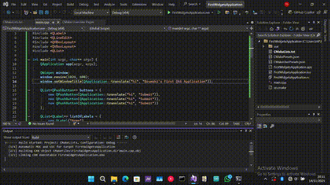

# FirstWidgetsApplication

This repo is for tracking my learning of the Qt Framework.



*Prerequisites:*
+ C++20 Compiler
+ CMake 3.30 or above
+ Qt Framework - 6.10 or above
    + Qt6::Core
    + Qt6::Gui
    + Qt6::Widgets
+ Command Line/Terminal
---
*Supported Platforms (Tested):*
+ Windows 11
+ Linux Mint Cinnamon 22.2
---
*Platforms it might work for:*
+ Windows 10
+ Ubuntu
+ Debian
+ etc
---
*How to build and run:*
```bash
$ git clone https://github.com/lil-brumski/FirstWidgetsApplication.git
$ cd FirstWidgetsApplication
$ mkdir build
$ cd build
$ cmake -DCMAKE_BUILD_TYPE="Release" ..
$ cmake --build . --config Release
$ ./second
```
---
This project uses the following third party libraries:
+ Qt6 - [LGPL](https://doc.qt.io/qt-6/lgpl.html)

